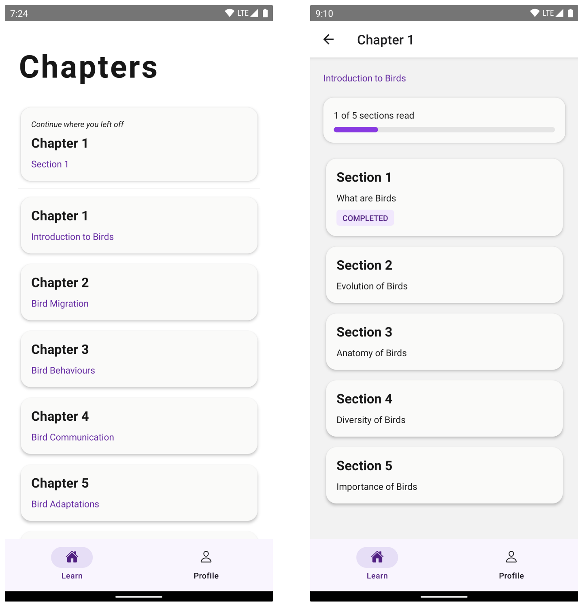

# LearnNow

**LearnNow** is a mobile app for reading content, designed to provide a seamless reading experience with a simple authentication module to ensure that your progress is saved and secure.

The app features a user-friendly interface, with a list of contents divided into chapters, each with multiple sections. These sections include both text and images, providing a rich and engaging reading experience.

## Features

### Authentication

Simple username-and-password based authentication to access the app.

### Chapters and Sections

The content from the backend is organised into chapters and sections for easy navigation. Additionally, the last-read section is pinned to the top of the `Chapters` screen, to jump straight back reading.

Not only does the app remember the last section you read, but it also tracks the exact position in the section you stopped at. This works for all sections, which especially helps those who like to jump back and forth between sections.

Moreover, the read progress is saved to your username, meaning multiple users can use the same app on the same phone and still have their individual progresses right there when they need it.

### Rich Content

Every sections can contain both text and images, enhancing the reading experience with more context.

### Profile

Users can also change their passwords or logout from the `Profile` screen.

## Developers

### Tech Stack

Frontend (mobile app)
* [React Native](https://github.com/facebook/react-native) framework
* [NativeBase](https://github.com/GeekyAnts/NativeBase) UI component library

Backend
* [Django](https://github.com/django/django) framework